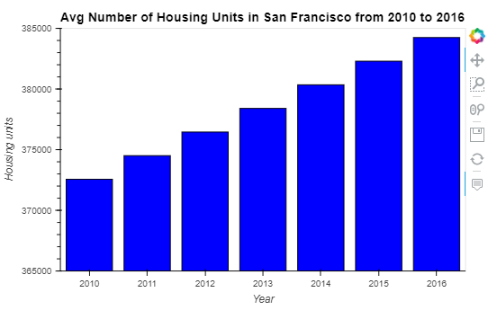
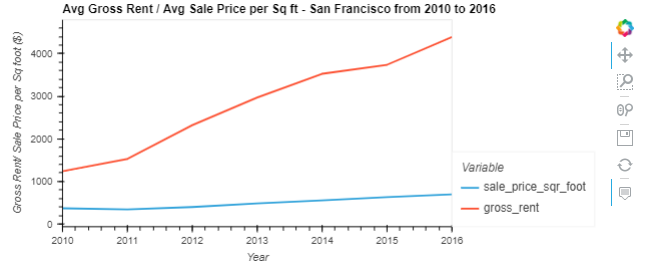
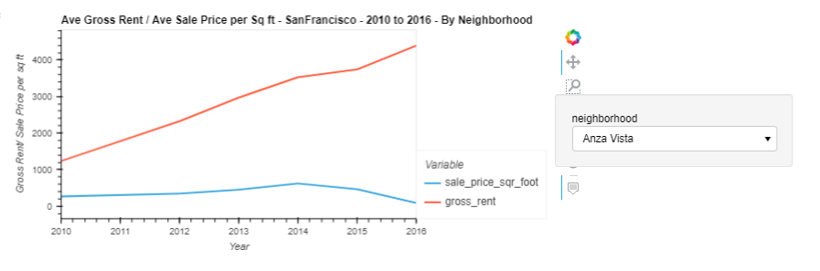
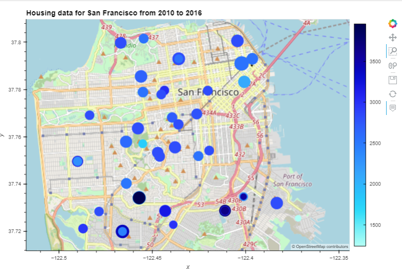

# Custom_Visualization

# Data Visualization in a Real Estate Market (San Francisco)

Analysis for a one-click service for people to buy properties and then rent them in San Francisco. Using data visualization, aggregation, interactive visualizations, and geospatial analysis, to find properties in the San Francisco market that are viable investment opportunities.
---
# Analysis

## Part 1: Calculate and Plot the Housing Units per Year




**Question:** What is the overall trend in housing_units over the period being analyzed?

**Answer:** The average number of housing units has seen a steady increase over the period being analyzed. The average number of housing units increased from 372560 units in 2010 to 384242 units in 2016, a total increase of 3.04% over 6 years and an average increase of 0.5% per year.  

## Part 2: Calculate and Plot the Average Sales Prices Per Square Foot



**Question:** What is the lowest gross rent reported for the years included in the DataFrame?

**Answer:** The lowest average gross rent was $ 1239 for the year 2010

**Question:** Did any year experience a drop in the average sale price per square foot compared to the previous year?

**Answer:** There was a drop in average sale price per square foot in 2011 to `$`341.90 as compared to 2010 from `$`369.35, a decrease of about 8% 

**Question:** If so, did the gross rent increase or decrease during that year?
​
**Answer:** The gross rent however, increased from `$`1239 in 2010 to `$`1530 in 2011, an increase of 19%. 

## Part 3: Compare the Average Sale Prices by Neighborhood



**Question:** For the Anza Vista neighborhood, is the average sale price per square foot for 2016 more or less than the price that’s listed for 2012?

**Answer:** For Anza Vista neighborhood, the average sale price per square foot for 2016 was $88.40, which was significantly less than $344.49 in 2012

## Part 4: Build an Interactive Neighborhood Map



**Question:** Which neighborhood has the highest gross rent, and which has the highest sale price per square foot?

**Answer:** The neighborhood with highest gross rent is The Westwood Park neighborhood with a rent amount of $3959. This is the circle with the darkest blue color on the map. The neighborhood of Union Square Districs has the highest sale price per square foot of $903.99. This is seen as the biggest sized circlr on the map.

---
## Compose Your Data Story

Based on the visualizations that you have created, compose a data story that synthesizes your analysis by answering the following questions:

**Question:** How does the trend in rental income growth compare to the trend in sales prices? Does this same trend hold true for all the neighborhoods across San Francisco?

**Answer:** The rental income seems to show a rapid increase over the years as compared to the sales prices. The growth in rental income looks very steep as against a little to no increase in the sales price over the same period of time.

In almost all neghborhoods, the rental income has increased by more than 100%, exceptions being the neighborhood of Forest Knolls, where the increase is less than 100%.

As far as the sales price per square foot is concerned, with the exceptions of Anza Vista, South Beach, Hayes Valley, Park North, Ingleside, and Ocenview - all other properties show an increase in the overall sale price.

In conclusion, the data shows that the investment in real estate in San Francisco, indicate rental income growth and increase in sales price per square foot. Investors will enjoy a positive cash flow and an increase in asset value.

**Question:** What insights can you share with your company about the potential one-click, buy-and-rent strategy that they're pursuing? Do neighborhoods exist that you would suggest for investment, and why?

**Answer:** Given the nature of the risk involved in the one-click, buy-and-rent strategy thst the company is pursuing, it would be helpful if we find neighborhoods with low sales price per square foot and high rental income for good return on investments. For the interactive maps, it means a small size dark blue spot on the map. Analyzing the map, we can find two such spots on the map corresponding to the neighborhoods of Silver Terrace (Gross_Rent = $3528 and Sale Price/Sq Foot = $170.29) and the Visitacion Valley (Gross_Rent = $3675 and Sale Price/Sq Foot = $301.47). A direct comparison can only be made between these two if we can assume that the unit size is same. Another neighborhood that might be considered for investment purposes is that of Outer Mission (Gross_Rent = $2996 and sales price/sq ft = $242.37)

---

## Technologies

This project uses python 3.7 along with the following packages:

* [JupyterLab](https://jupyterlab.readthedocs.io/en/stable/) - Web based user interface for data analysis.

* [pandas](https://github.com/pandas-dev/pandas) - Data analysis and manipulation library.

* [dotenv](https://pypi.org/project/python-dotenv/) - Python-dotenv reads key-value pairs from a .env file and can set them as environment variables.

* [hvplot](https://pyviz-dev.github.io/hvplot/) - A high-level plotting API for the PyData ecosystem built on HoloViews.

* [GeoViews](https://geoviews.org/) - GeoViews is built on the HoloViews library for building flexible visualizations of multidimensional data.

---

## Installation Guide

Please install the following before starting the application

```python
  pip install jupyterlab
  pip install pandas
  pip install dotenv
  conda install -c pyviz hvplot geoviews
```

Confirm installation by running:
```python
  conda list hvplot
  conda list geoviews
```
---

## Usage

To use the custom visualization tools, please download and open the **san_francisco_housing.ipynb** in jupyter lab after executing
the following on the command line:

```python
jupyter lab
```
Jupytper Lab should open automatically in a browser. 
If it does not, please follow the instructions on the command line.

---

## Contributors

Abhishika Fatehpuria (abhishika@gmail.com)

---

## License

MIT